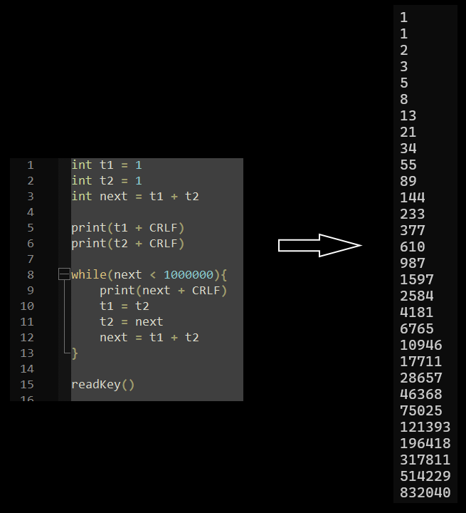

# SylphScript 🧚

Welcome to SylphScript! 🎉

SylphScript is a programming language inspired by C#.

## Features ✨

- **Simplified Syntax**: Enjoy a syntax similar to C#!
- **Everything expandable**: Almost every aspect of SylphScript is extendable, allowing you to customize parsers, functions, types, and more with ease.
- **Interactive Interpreter**: SylphScript functions as an interpreter, enabling rapid development and testing of your code.

## Getting Started 🚀

To start using SylphScript, follow these simple steps:

1. **Install SylphScript**: Download the latest version of SylphScript interpreter.
2. **Write Your Code**: Craft your SylphScript code using your favorite text editor.
3. **Run the Interpreter**: Execute your SylphScript code using the interpreter to see it in action!

## Example Code 💻

You can find more examples [here](Samples).

Fibonacci numbers:

[](Samples/fibonacci.syl)

## Function Registration 📝

Before using functions in SylphScript, make sure to register them. Here's how you can do it:

```
string addTest(string str){
    return "Test: " + str
}
```

## Classes and Objects 🏗️

Classes in SylphScript support object-oriented programming principles. Here's an example of defining and using a class:

```
class Vector{
	int X = 0
	int Y = 0
	
	Vector Vector(){}
	
	Vector Vector(int x, int y){
		Vector v = Vector()
		v.X = x
		v.Y = y
		return v
	}
	
	static Vector Add(Vector v1, Vector v2){
		return Vector(v1.X + v2.X, v1.Y + v2.Y)
	}
}

Vector vec = Vector(3, 5)
int x = Vector.Add(vec, Vector(2, 7)).X
print("X:" + x)
```

## Value/Reference Semantics 🔄

SylphScript supports value and reference semantics, allowing efficient handling of variables:

```
string tstr1 = "Test"       // variable initialization
string tstr2 = tstr1        // Value would be copied
string tstr3 =* tstr1       // Reference would be copied
tstr1 =+ tstr1 + "1"        // Assignment of a new value for "tstr1" but also for all references! If you change "=+" to "=" just "tstr1" would be overwritten.
```

## License 📄

SylphScript is licensed under the [MIT License](LICENSE).

## Disclaimer

This programming language isn't finished and can contain bugs.